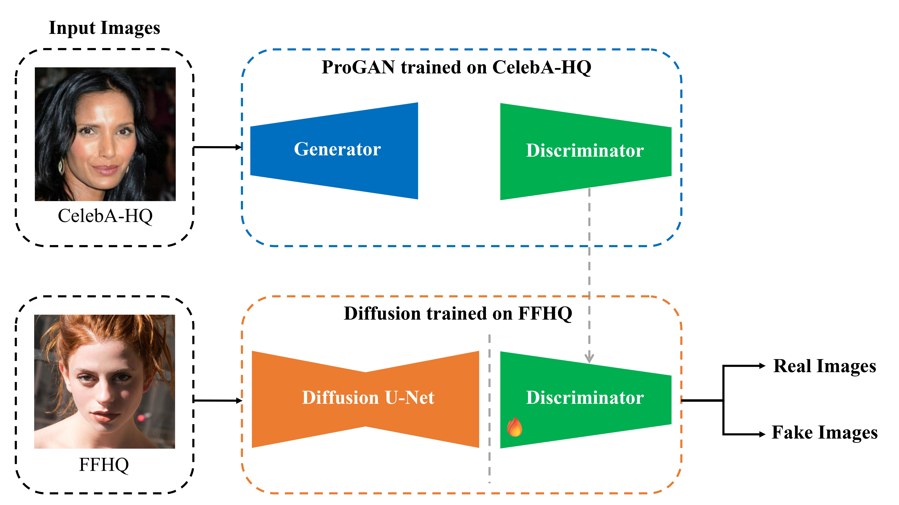
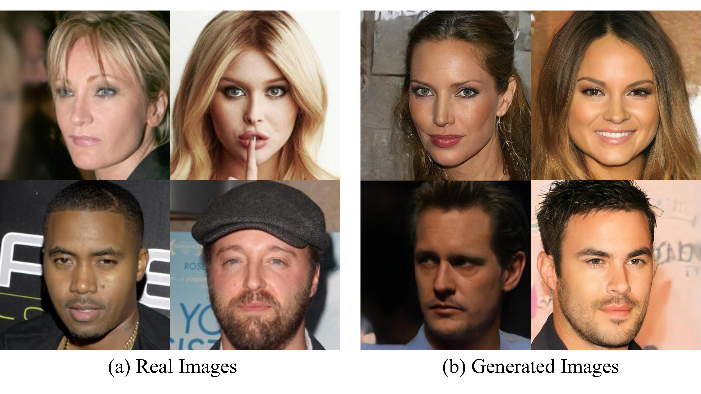

# CIPHER: Counterfeit Image Pattern High-level Examination via Representation for GAN and Diffusion Discriminator Learning

## Abstract

The rapid progress of generative adversarial networks (GANs) and diffusion models has enabled the creation of synthetic faces that are increasingly difficult to distinguish from real images. This progress, however, has also amplified the risks of misinformation, fraud, and identity abuse, underscoring the urgent need for detectors that remain robust across diverse generative models. In this work, we introduce Counterfeit Image Pattern High-level Examination via Representation(CIPHER), a deepfake detection framework that systematically reuses and fine-tunes discriminators originally trained for image generation. By extracting scale-adaptive features from ProGAN discriminators and temporal-consistency features from diffusion models, CIPHER captures generation-agnostic artifacts that conventional detectors often overlook. Through extensive experiments across nine state-of-the-art generative models, CIPHER demonstrates superior cross-model detection performance, achieving up to 74.33% F1-score and outperforming existing ViT-based detectors by over 30% in F1-score on average. Notably, our approach maintains robust performance on challenging datasets where baseline methods fail, with up to 88% F1-score on CIFAKE compared to near-zero performance from conventional detectors. These results validate the effectiveness of discriminator reuse and cross-model fine-tuning, establishing CIPHER as a promising approach toward building more generalizable and robust deepfake detection systems in an era of rapidly evolving generative technologies.

### This study has been accepted for ICCE-Asia 2025.

This repository provides publicly available training datasets and experimental code used in CIPHER for research purposes.

---

## Project Introduction

This project provides skeleton code for the final team project of the 2025 4th OUTTA AI Bootcamp Deep Learning Advanced course. 
 
This project focuses on generating images and detecting fake (Deep fake) images. 
 
The goal of this project is to generate high-quality fake images using ProGAN and DDPM/DDIM, and to implement deepfake detection models across various datasets including the generated images. 
 
For detailed guidelines and evaluation criteria for this project, please refer to the uploaded '2025_final_project_guideline.pdf'. 
 
This project is designed to run in a Google Colab environment by default. 
 

---

## Dataset

The dataset can be downloaded from the following [link](https://drive.google.com/drive/folders/1CLorHX2LxSPdwZqsNw2F4QbSkmnVEkJM?usp=sharing). 
 
The dataset utilizes [CelebA-HQ](https://github.com/tkarras/progressive_growing_of_gans) and [FFHQ](https://github.com/NVlabs/ffhq-dataset). 

---

## Performance Comparison
**Fig.1 Performance Comparison: Accuracy (%) and F1-score (%) across Multiple Datasets**

**Fig.2 Comparison of Deepfake Detection Models**
<table>
  <thead>
    <tr>
      <th>Model Name</th>
      <th>Architecture</th>
      <th>Accuracy</th>
    </tr>
  </thead>
  <tbody>
    <tr>
      <td><a href="https://huggingface.co/dima806/deepfake_vs_real_image_detection">dima806/deepfake_vs_real</a></td>
      <td>ViT-base</td>
      <td>99.27%</td>
    </tr>
    <tr>
      <td><a href="https://huggingface.co/Wvolf/ViT_Deepfake_Detection">Wvolf/ViT_Deepfake</a></td>
      <td>ViT</td>
      <td>98.70%</td>
    </tr>
    <tr>
      <td><a href="https://github.com/YZY-stack/DF40">DF40 XceptionNet</a> </td>
      <td>XceptionNet</td>
      <td>98.84%</td>
    </tr>
    <tr>
      <td><a href="https://huggingface.co/strangerguardhf/vit_deepfake_detection">strangerguardhf/vit_deepfake</a></td>
      <td>ViT-base</td>
      <td>95.16%</td>
    </tr>
    <tr>
      <td><a href="https://huggingface.co/prithivMLmods/open-deepfake-detection">prithivMLmods/open-deepfake</a></td>
      <td>SigLIP-2</td>
      <td>94.44%</td>
    </tr>
    <tr>
      <td><a href="https://huggingface.co/prithivMLmods/deepfake-detector-model-v1">prithivMLmods/Deep-Fake</a></td>
      <td>SigLIP</td>
      <td>94.44%</td>
    </tr>
  </tbody>
</table>

---

## Reference

This repository is implemented based on [DDPM](https://github.com/hojonathanho/diffusion), [DDIM](https://github.com/ermongroup/ddim) and [ProGAN](https://github.com/tkarras/progressive_growing_of_gans).

---

## Notice
When using this project, please be sure to credit OUTTA as the source. Unauthorized distribution of materials without OUTTA's permission is strictly prohibited.
